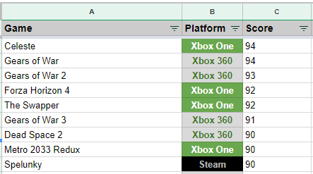

# Metacritic Google Sheets
Write Metacritic scores to game libraries in Google Sheets.

## Motivation
I wrote these scripts to help prioritize my gaming backlog by listing Metacritic score with all games in my library and 
Xbox Game Pass games. Finding nothing online that completed this task, I decided to create a very simple 
implementation using Python and Google Sheets.

I consider myself a novice Python developer so any and all criticism to the approach, code, and documentation is welcome.
 Please feel free to email me at JCarlee@gmail.com with suggestions or ideas.

## Dependencies
* Python 3
* BeautifulSoup4
* gspread
* urllib
* oauth2client.service_account
```
pip install bs4
pip install gspread
pip install urllib
pip install oauth2client
```
## Google Sheets Personal Library Setup
[Create Copy of Template](https://docs.google.com/spreadsheets/d/138_jFzCP4pk1-UBBEzkiz0etvm9iSmuNUnO_-ABIVcs/edit?usp=sharing)

_Or follow setup below:_

Sheet name: **Library**
* Column A: Game
* Column B: Platform
* Column C: Score

Name your credentials file `meta-credentials.json` or modify `personal-library.py` with your .json file name. 



Create second sheet named **Python**  
This sheet holds the value for final row in Library sheet.  

Cell A2:  
`=right(address(match("zzz", Library!A:A),1 , 4, 1), 2)`

[OAuth2 setup](https://gspread.readthedocs.io/en/latest/oauth2.html)

### Platforms supported
* Xbox One
* Xbox 360
* PC
* Steam
* uPLAY
* Epic Launcher
* Origin
* GOG

## [personal-library.py](personal-library.py)
* Provides metacritic score updates to a personal game library

## [game-pass.py](game-pass.py)
* Uses a Google Spreadsheet library of Xbox Game Pass games to update the Metacritic score of games using BeautifulSoup.


## Author

* **John Carlee** - JCarlee@gmail.com
